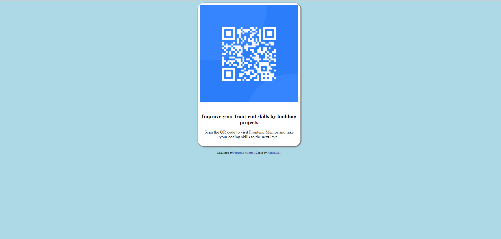

# Frontend Mentor - QR code component solution

This is a solution to the [QR code component challenge on Frontend Mentor](https://www.frontendmentor.io/challenges/qr-code-component-iux_sIO_H). Frontend Mentor challenges help you improve your coding skills by building realistic projects. 

## Table of contents

- [Overview](#overview)
  - [Screenshot](#screenshot)
- [My process](#my-process)
  - [Built with](#built-with)
  - [What I learned](#what-i-learned)
- [About me](#aboutme)

## Overview

### Screenshot

## My process

### Built with

- Semantic HTML5 markup
- CSS custom properties
- Flexbox

### What I learned

- Structuring a mixture of different kinds of components (including texts, images, divs, etc.) on a website, by using plain HTML. 
- Arranging HTML structures with the use of CSS. 
- Without using any framework or tool supported, I can master core concepts of web development effectively! 

## About Me

- Website - [Kelvin Mock](https://kmock930.github.io/) - under development!!!
- LinkedIn - [King Lun (Kelvin) Mock](https://www.linkedin.com/in/king-lun-kelvin-mock-548666173/)
- GitHub - [kmock930](https://github.com/kmock930)
- Frontend Mentor - [@kmock930](https://www.frontendmentor.io/profile/kmock930)
- Twitter - [@kelvinmock0930](https://twitter.com/kelvinmock0930)
- Instagram - [@kelvmock930](https://www.instagram.com/kelvmock930/)